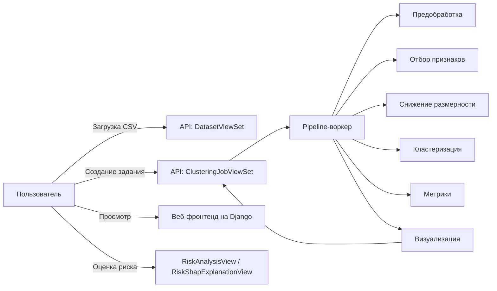

**Техническое задание на сервис кластеризации датасетов налогоплательщиков**  

---

## 1. Введение  
Сервис предназначен для автоматизированной обработки и кластеризации пользовательских CSV‑датасетов. Основная цель — предоставить гибкий, расширяемый инструмент, позволяющий:  
- Загружать датасеты  
- На лету выбирать методы отбора признаков, снижения размерности и алгоритмы кластеризации  
- Получать на выходе размеченный по кластерам датасет, набор метрик качества и визуализации  

---

## 2. Цели и задачи  
1. **Загрузка и хранение**  
   - Приём CSV-файлов через REST API и веб‑интерфейс  
   - Сохранение файлов в файловой системе (media/) и метаданных в БД  
2. **Конфигурируемая конвейерная обработка**  
   - Предобработка (заполнение пропусков, удаление выбросов, трансформации, масштабирование)  
   - Отбор признаков (Correlation, KMeans, Mutual Information, Variance Threshold, PCA, t‑SNE)  
   - Снижение размерности (Autoencoder, Kernel PCA, Factor Analysis, UMAP)  
   - Кластеризация (DBSCAN, KMeans, GMM, Agglomerative, OPTICS, Spectral)  
3. **Мониторинг и управление заданиями**  
   - Отслеживание статусов (Pending → Processing → Completed/Failed)  
   - Хранение промежуточных и итоговых результатов  
4. **Метрики**  
   - Инерция, Silhouette, Davies‑Bouldin, Dunn Index, ARI, NMI, Calinski‑Harabasz  
5. **Визуализация**  
   - PCA, t‑SNE, UMAP, матрица расстояний, дендрограмма, scatter‑plot  
6. **Оценка риска**  
   - Простейший скор по сумме признаков и SHAP‑объяснение  

---

## 3. Функциональные требования  

| №  | Функция                            | Описание                                                                                                                                       |
|----|------------------------------------|------------------------------------------------------------------------------------------------------------------------------------------------|
| 1  | Загрузка датасета                  | REST-эндпоинт `/api/datasets/` (POST), веб-форма `/datasets/upload/`                                                                            |
| 2  | Список датасетов                   | `/api/datasets/` (GET), веб-страница `/datasets/`                                                                                               |
| 3  | Создание задания                   | `/api/clustering-jobs/` (POST) с указанием ID датасета и параметров конвейера                                                                   |
| 4  | Этапная обработка                  | `…/preprocess/`, `…/feature_selection/`, `…/dimensionality_reduction/`, `…/clustering/`, `…/metrics/`, `…/visualization/` (POST)                 |
| 5  | Полностью “одним кликом”           | `…/execute_all_steps/` (POST) запускает все этапы последовательно                                                                              |
| 6  | Просмотр статуса и промежуточных   | Детали задания (`/api/clustering-jobs/{id}/` + веб-страница), флаги `*_completed`, список CSV- и изображений                                    |
| 7  | Визуализация результатов           | REST отдаёт JSON со списком URL на PNG; фронтенд показывает превью и открывает полноразмерные графики                                            |
| 8  | Оценка и объяснение риска          | `/api/risk-analysis/{job_id}/` (GET) — табличные risk_score и color; `/api/risk-analysis/{job_id}/{index}/` — SHAP‑график                        |
| 9  | Администрирование                  | Django‑админка для моделей Dataset, ClusteringJob, ClusteringParameters                                                                       |

---

## 4. Нефункциональные требования  
- **Производительность**: поддержка датасетов до ~100 000 строк; по возможности использовать батчевую обработку и отложенные задачи (Celery).  
- **Масштабируемость**: архитектура с разделением API и воркеров, контейнеризация Docker + docker-compose.  
- **Надёжность**: отслеживание ошибок на каждом этапе, переход в статус Failed с логированием.  
- **Расширяемость**: модульный код (каждый метод в своём файле), простая регистрация новых алгоритмов.  
- **Безопасность**: CSRF в веб‑форме, CORS для API, настройка в продакшне DEBUG=False, безопасное хранение SECRET_KEY, ограничения по размеру загружаемых файлов.  
- **Удобство использования**: интуитивный UI с горячей загрузкой пресетов и динамическим показом параметров.  

---

## 5. Архитектура и компоненты  

---

## 6. Модель данных (основные таблицы)

- **Dataset**  
  - `id: UUID`, `name: string`, `uploaded_at: datetime`, `file: FileField`
- **ClusteringJob**  
  - `id: UUID`, `dataset: FK`, `status: enum`, `created_at`, `completed_at`  
  - флаги стадий (Boolean), `intermediate_files: JSON`, `result_file: FileField`
  - `metrics: JSON`, `visualizations: JSON`
- **ClusteringParameters** (OneToOne → ClusteringJob)  
  - `feature_selection_method`, `dimensionality_reduction_method`, `clustering_algorithm`, `parameters: JSON`

---

## 7. REST API

| Метод | URL                                    | Описание                                 |
|-------|----------------------------------------|------------------------------------------|
| GET   | `/api/datasets/`                       | Список датасетов                        |
| POST  | `/api/datasets/`                       | Загрузка датасета                       |
| GET   | `/api/datasets/{id}/`                  | Детали датасета                         |
| GET   | `/api/clustering-jobs/`                | Список заданий                          |
| POST  | `/api/clustering-jobs/`                | Создание нового задания                 |
| GET   | `/api/clustering-jobs/{id}/`           | Детали задания                         |
| POST  | `/api/clustering-jobs/{id}/preprocess/`| Запустить предобработку                 |
| POST  | `/api/clustering-jobs/{id}/feature_selection/`      | Отбор признаков           |
| POST  | `/api/clustering-jobs/{id}/dimensionality_reduction/`| Снижение размерности      |
| POST  | `/api/clustering-jobs/{id}/clustering/`| Кластеризация             |
| POST  | `/api/clustering-jobs/{id}/metrics/`   | Расчёт метрик            |
| POST  | `/api/clustering-jobs/{id}/visualization/`| Генерация визуализаций    |
| POST  | `/api/clustering-jobs/{id}/execute_all_steps/`| Запустить все этапы      |
| GET   | `/api/presets/`                        | Список пресетов                         |
| GET   | `/api/risk-analysis/{job_id}/`         | Таблица risk_score                      |
| GET   | `/api/risk-analysis/{job_id}/{idx}/`   | SHAP‑график для записи                  |

---

## 8. Веб‑интерфейс  

1. **Главная**: навигация → датасеты, задания, загрузка, создание задания.  
2. **Загрузка датасета**: простая форма с именем и CSV.  
3. **Список датасетов**: табличный вывод с id, именем, датой, кнопкой “Детали”.  
4. **Детали датасета**: превью (первые 5 строк), колонки, ссылка на скачивание.  
5. **Создание задания**: выбор датасета, пресет или ручная настройка трёх блоков параметров (динамически показываются только нужные поля).  
6. **Список заданий**: id, датасет, статус, дата создания, кнопка “Детали”.  
7. **Детали задания**:  
   - Карточка с основными сведениями и статусами стадий  
   - Параметры, метрики, превью визуализаций  
   - Кнопки запуска этапов по‑отдельности и “Выполнить все”  
   - Список ссылок на промежуточные CSV  
   - Переход к оценке рисков  
8. **Анализ риска**: табличка с индексами записей, нормированным score (0–1), цветовая шкала и кнопка “Посмотреть SHAP” для каждой строки.  

---

## 9. Технологический стек  

- **Бэкенд**: Python 3.10, Django 4.x, Django REST Framework  
- **БД**: PostgreSQL (в продакшне) / SQLite (локально)  
- **Фоновые задачи**: Celery + Redis (рекомендация для тяжёлых датасетов)  
- **Контейнеризация**: Docker + docker-compose  
- **Машинное обучение**: scikit-learn, TensorFlow (Autoencoder), UMAP, SHAP  
- **Визуализация**: matplotlib, seaborn  
- **Фронтенд**: Django‑шаблоны + Bootstrap 5 + vanilla JS (fetch API)  
- **CI/CD**: GitHub Actions — тестирование, линтинг, сборка образов  

---

## 10. Планы по улучшению и расширению  

1. **Очередь задач**: подключить Celery для асинхронной обработки  
2. **Авторизация**: JWT‑авторизация, разграничение доступа по пользователям  
3. **WebSocket**: live‑обновление статуса с помощью Django Channels  
4. **Доп. алгоритмы**: интеграция HDBSCAN, t‑SNE кластеризации, UMAP‑кластеризации  
5. **Наборы предобработки**: автоматическое определение и подбор пайплайнов (AutoML‑подход)  
6. **ML‑сервисы**: REST‑экспонирование обученных автоэнкодеров / моделей для переиспользования  
7. **UI/UX**: интерактивные графики (Plotly/D3.js), drag‑&‑drop загрузка, многопользовательская работа с панелью заданий  

---

Это техническое задание задаёт основу для развития и поддержки сервиса кластеризации, обеспечивая ясность по структуре, функциональности и архитектуре.